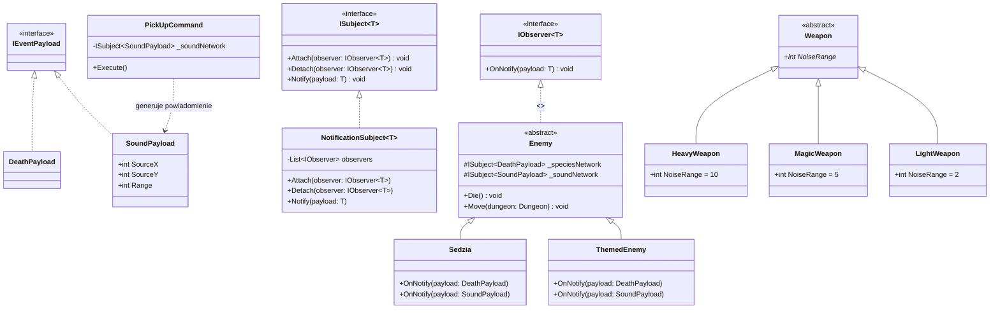

```mermaid
classDiagram
%% Wzorzec Obserwator - Interfejsy bazowe
    class IEventPayload {
        <<interface>>
    }

    class IObserver~T~ {
        <<interface>>
        +OnNotify(payload: T) void
    }

    class ISubject~T~ {
        <<interface>>
        +Attach(observer: IObserver~T~) void
        +Detach(observer: IObserver~T~) void
        +Notify(payload: T) void
    }

%% Typy powiadomień
    class DeathPayload { }
    class SoundPayload {
        +int SourceX
        +int SourceY
        +int Range
    }

    IEventPayload <|.. DeathPayload
    IEventPayload <|.. SoundPayload

%% Konkretny Podmiot
    class NotificationSubject~T~ {
        -List~IObserver~ observers
        +Attach(observer: IObserver~T~)
        +Detach(observer: IObserver~T~)
        +Notify(payload: T)
    }
    ISubject <|.. NotificationSubject

%% Przeciwnicy z Legiolandu jako Obserwatorzy
    class Enemy {
        <<abstract>>
        #ISubject~DeathPayload~ _speciesNetwork
        #ISubject~SoundPayload~ _soundNetwork
        +Die() void
        +Move(dungeon: Dungeon) void
    }

    IObserver <|.. Enemy : <<implementuje IObserver~DeathPayload~ oraz IObserver~SoundPayload~>>

    class Sedzia {
        +OnNotify(payload: DeathPayload)
        +OnNotify(payload: SoundPayload)
    }
    class ThemedEnemy {
        +OnNotify(payload: DeathPayload)
        +OnNotify(payload: SoundPayload)
    }

    Enemy <|-- Sedzia
    Enemy <|-- ThemedEnemy

%% Bronie a hałas (Polimorfizm)
    class Weapon {
        <<abstract>>
        +int NoiseRange*
    }
    class HeavyWeapon {
        +int NoiseRange = 10
    }
    class MagicWeapon {
        +int NoiseRange = 5
    }
    class LightWeapon {
        +int NoiseRange = 2
    }

    Weapon <|-- HeavyWeapon
    Weapon <|-- MagicWeapon
    Weapon <|-- LightWeapon

%% Punkt zapalny powiadomienia o dźwięku
    class PickUpCommand {
        -ISubject~SoundPayload~ _soundNetwork
        +Execute()
    }
    PickUpCommand ..> SoundPayload : generuje powiadomienie
```